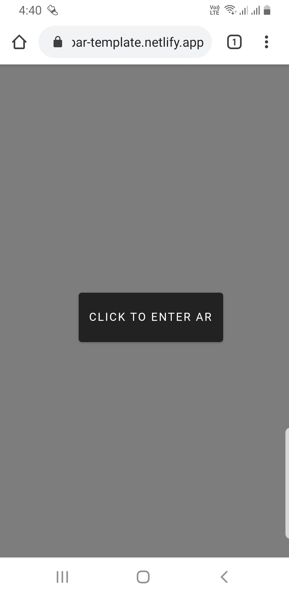
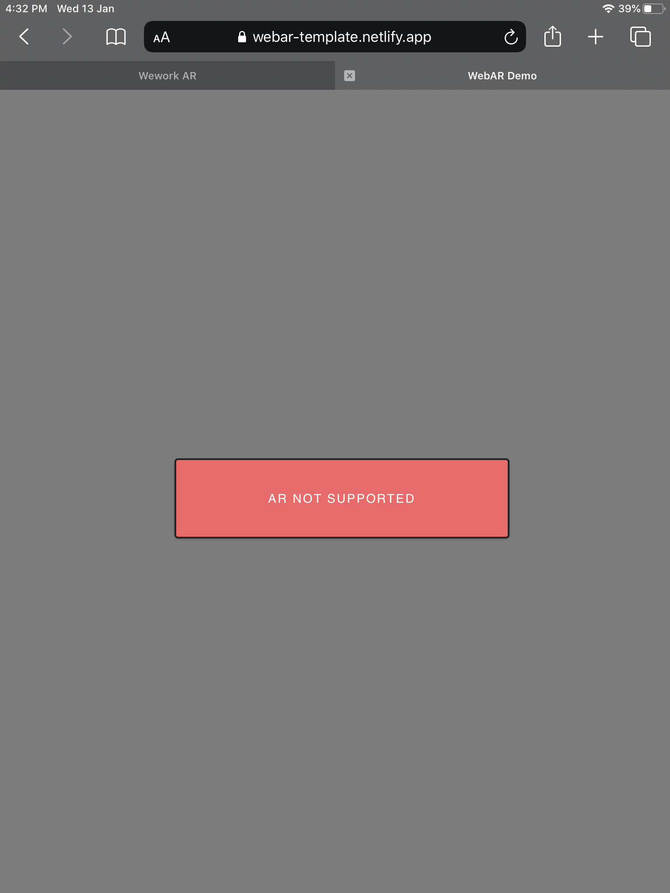

## Full View AR template for WebXR Exporter with Unity WebGL
For anyone using the webxr-exporter for building ar experiences can use this template for improved user experience.

### Features:
1. Covers the full device screen maximising the screen space.  
2. UI Feedback for unsupported devices
3. Bloat-free

### How to use:
1. Clone or download the repo.
2. If you've an existing WebXR project made with Oren's/Mozilla webxr exporter, just paste the WebARFullView folder in the WebGL templates folder in your Assets. 
3. Else, if you're starting fresh, just load the Sample Project that comes with the repo in Unity. The template is included in the project.  

### Tested on:
**iOS:** iPad 6th Gen on Safari, Chrome, WebXR Viewer. 
Currently, WebXR library is supported only on the WebXR Viewer browser by Mozilla which can be downloaded for free from the App store.

**Android:** Samsung Galaxy S8 on Chrome.

### Screenshots:

For compatible devices:

If the device isn't compatible:

